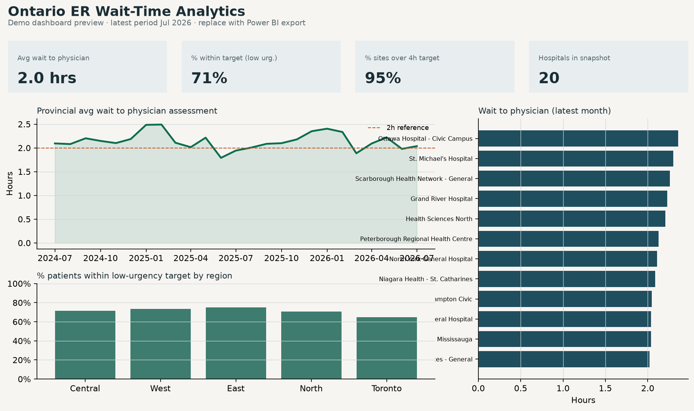

# Ontario ER Wait-Time Analytics Dashboard

End-to-end healthcare analytics pipeline: messy Ontario ED wait-time extract → Python clean → SQL transforms → SQLite → data quality checks → Power BI–ready tables.

Built to demonstrate SQL/Python data automation, data quality checks, and Power BI/DAX dashboarding on a hospital-relevant dataset.



## What it does

1. Loads a raw ED wait-time file (CSV export style, or legacy fixed-width / SAS-style dump)
2. Cleans hospital names, dates, nulls, and percent fields in Python
3. Deduplicates and builds dimensional + fact tables in SQL
4. Runs pass/fail data quality checks (row counts, null thresholds, ranges, duplicate keys)
5. Exports clean CSVs for Power BI with documented DAX measures

One command refreshes raw → clean:

```bash
python etl/run_pipeline.py
```

## Quick start

```bash
python3 -m venv .venv
source .venv/bin/activate          # Windows: .venv\Scripts\activate
pip install -r requirements.txt

# Generate demo raw extract (or drop in your own Ontario Health CSV export)
python scripts/generate_sample_raw.py

# Refresh database + DQ report + Power BI CSVs
python etl/run_pipeline.py

# Optional: same pipeline from fixed-width legacy file (SAS conversion path)
python etl/run_pipeline.py --source fixed-width

# Local GUI dashboard (filters, KPIs, charts, pipeline refresh)
streamlit run app.py

# Static dashboard preview image for README
python scripts/render_dashboard_preview.py
```

Outputs:

| Path | Purpose |
|---|---|
| `data/db/ontario_er.db` | SQLite DB (`stg_`, dims, `fact_ed_wait`, `mart_hospital_month`) |
| `data/processed/mart_hospital_month.csv` | Wide table for Power BI |
| `data/processed/ed_wait_times_clean.csv` | Indicator-level fact for drill-through |
| `reports/data_quality_report.txt` | Pass/fail DQ report |

## Data source

Schema mirrors the public **Ontario Health — Time Spent in Emergency Departments** reporting export ([HQ Ontario / Ontario Health](https://hqontario.ca/System-Performance/Time-Spent-in-Emergency-Departments)), sourced upstream from CIHI NACRS.

The bundled `data/raw/` files are **synthetic demo data** calibrated to published provincial averages (physician assessment ~1.8–2.2 hrs; LOS targets 4h / 8h / 8h). They intentionally include messy hospital-name variants, mixed date formats, nulls, and duplicate keys so the cleaning + DQ steps are real.

To use a live export: download CSV from the Ontario Health portal and replace `data/raw/ed_wait_times_export.csv` (keep the same column headers), then re-run the pipeline.

## Repo map

```
app.py                       # Streamlit GUI dashboard
etl/run_pipeline.py          # one-command automation
etl/convert_fixed_width.py   # fixed-width → CSV
sql/transforms.sql           # dims, fact, mart
sql/quality_checks.sql       # DQ checks
sas/legacy_extract.sas       # original SAS snippet
sas/CONVERSION.md            # SAS → Python/SQL mapping
powerbi/measures.dax         # DAX measures
powerbi/DASHBOARD_BUILD.md   # 4-visual build guide
```

## Local GUI

```bash
streamlit run app.py
```

Opens an interactive dashboard with region/hospital filters, the same KPI logic as the DAX measures, trend + hospital charts, the DQ report, and a **Refresh pipeline** button.

## Power BI + DAX

See `powerbi/DASHBOARD_BUILD.md`. Core measures in `powerbi/measures.dax`:

- **Avg Wait to Physician (hrs)** — volume-weighted average
- **% Hospital-Months Over Low-Urgency Target** — share of hospital-months above Ontario’s 4h low-urgency LOS target

Connect Power BI Desktop to `data/processed/mart_hospital_month.csv`, paste the DAX, build the four visuals, then export a screenshot over `docs/dashboard_preview.png`.

## Data quality checks

Every refresh prints and writes a report covering:

- Fact / mart row counts
- Null threshold on `avg_hours` (≤ 5%)
- `avg_hours` in expected range (0–72)
- No duplicate natural keys
- `pct_within_target` in 0–100
- Staging → fact dedupe accounting

## SAS → SQL/Python

`sas/legacy_extract.sas` shows the classic fixed-width + sort/dedupe pattern. The Python/SQL equivalents are documented in `sas/CONVERSION.md` and exercised via `--source fixed-width`.

## License / disclaimer

Demo analytics project for portfolio use. Not affiliated with Ontario Health or CIHI. Not for clinical decision-making.
